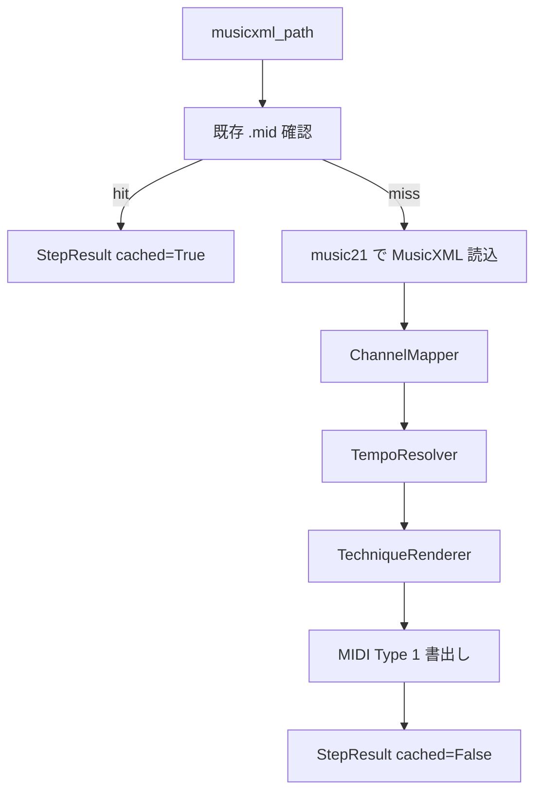
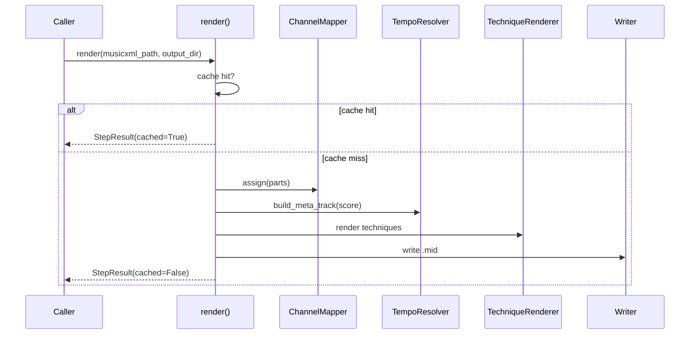

# Design Document — midi-render

## Overview

`midi-render` は、Transform ドメインが出力した補正済み MusicXML を MIDI Type 1 として書き出す Render ドメインである。
`music21` を主に MusicXML 解析に使い、`mido` を補助的に用いて Pitch Bend や CC イベントなどの低レベル MIDI 制御を行う。

**Users**: DTM 制作者、ギタリスト、耳コピ補助用途のユーザー

**Impact**: Transform で整えたパート情報と奏法を、DAW に投入可能な MIDI として安定出力する。

---

### Goals

- MusicXML から MIDI Type 1 を生成する
- パートロールごとのチャンネル / GM プログラム割り当てを行う
- Track 0 にテンポ・拍子・調号を格納する
- bend / slide / palm-mute / hammer-on / pull-off を MIDI イベントへ写像する
- `StepResult` とキャッシュファースト実行を提供する

### Non-Goals

- 品質スコアの算出
- OMR や Transform で失われた情報の推定補完
- DAW 固有フォーマット書き出し

---

## Requirements Traceability

| 要件 | 概要 | コンポーネント | インターフェース |
|---|---|---|---|
| 1.1-1.4 | MusicXML → MIDI Type 1 生成 | `MidiRenderer` | `render_score()` |
| 2.1-2.5 | チャンネル / プログラム割り当て | `ChannelMapper` | `assign(parts)` |
| 3.1-3.4 | メタトラック / テンポ処理 | `TempoResolver` | `build_meta_track()` |
| 4.1-4.5 | ギター奏法変換 | `TechniqueRenderer` | `render_note_techniques()` |
| 5.1-5.5 | エラー階層 / キャッシュ / 公開 API | `_render.py`, `errors.py` | `render()` |

---

## Architecture

### Architecture Pattern & Boundary Map



### Technology Stack & Alignment

| 技術 | 用途 |
|---|---|
| `music21` | MusicXML 読み込み、スコア走査 |
| `mido` | Pitch Bend / CC / Program Change 等の低レベル MIDI イベント構築 |
| `structlog` | 構造化ログ |

---

## Components and Interface Contracts

### `errors.py`

- `RenderError(PipelineError)`
- `RenderValidationError(RenderError)`
- `RenderExecutionError(RenderError)`

### `channel_mapper.py`

```python
PartRole = Literal["guitar", "bass", "drums", "other"]

@dataclass(frozen=True)
class ChannelAssignment:
    part_id: str
    role: PartRole
    midi_channel: int
    midi_program: int | None
```

責務:
- `guitar` → Ch.1 / Program 29
- `bass` → Ch.2 / Program 33
- `drums` → Ch.10 / Program None
- `other` → 空きチャンネル順割当

### `tempo_resolver.py`

責務:
- Track 0 のテンポ / 拍子 / 調号を構築する
- テンポ未指定時は 120 BPM を返し warning を生成する

### `midi_renderer.py`

責務:
- パートごとのノート列を MIDI トラックへ変換する
- `ChannelMapper` と `TempoResolver` の結果を統合する

### `technique_renderer.py`

責務:
- `<bend>`、`<slide>`、`<palm-mute>`、`<hammer-on>`、`<pull-off>` を MIDI イベントへ変換する
- 変換件数をメトリクス集計用に返す

### `_render.py`

責務:
- キャッシュ確認
- MusicXML 読み込み
- 各コンポーネントの呼び出し
- MIDI 書き出し
- `StepResult` の返却

---

## System Flows

