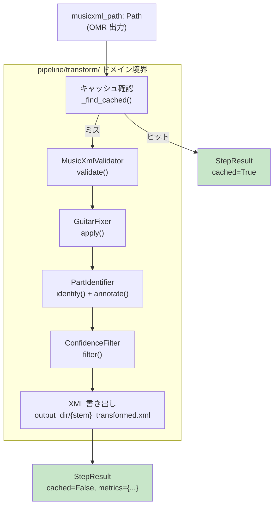
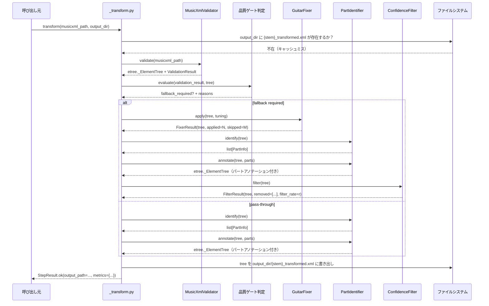
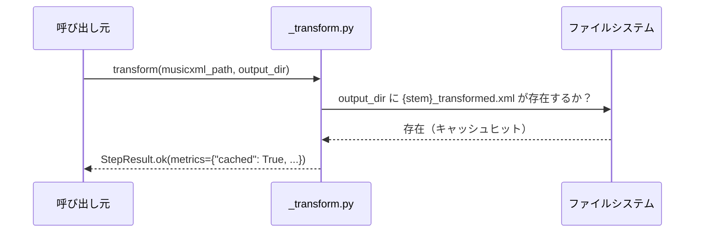

# Design Document — musicxml-transform

## Overview

`musicxml-transform` は、OMR ドメイン（`pipeline/omr/`）が出力した MusicXML を受け取り、ギター TAB フレット情報でピッチを補正し、パートロールを確定したうえで「補正済み MusicXML」を後続の Render ドメインへ渡す Transform ドメインである。

このドメインは `pipeline/omr/` と同じファイル構成パターンを採用し、`lxml` による直接 XML 操作を中核技術として使用する。各変換器は `etree._ElementTree` を内部通貨として受け渡し、ファイル I/O は入口（読み込み）と出口（書き出し）のみに限定する。信頼度フィルタは現フェーズではインフラのみ実装し、将来 Quality ドメインが信頼度属性を定義した際に本格稼働する。

**Users**: ギタリスト・DTM 制作者が CLI 経由でパイプラインを実行する際に、このドメインは透過的に動作する。ユーザーは `transform()` 関数を意識せず、正確なピッチ情報を持つ MIDI を得られる。

**Impact**: OMR が出力した五線譜音域ミスを TAB フレット情報で上書きすることで、下流の MIDI 生成精度が向上する。

---

### Goals

- TAB スタッフの `<fret>` / `<string>` 要素を読み取り五線譜 `<pitch>` を上書きする
- `guitar` / `bass` / `drums` / `other` のパートロールを自動確定し補正済み XML に記録する
- 信頼度フィルタのインフラを整備し、将来の Quality 連携に備える
- `StepResult` キャッシュファースト設計で同一入力に対する再処理をスキップする
- `mypy --strict` 相当・全モジュールのユニットテスト・カバレッジ 95%+ を達成する

### Non-Goals

- MIDI 生成（Render ドメインの責務）
- 画像前処理・OMR 実行（各上流ドメインの責務）
- 品質スコアの最終算出（Quality ドメインの責務）
- 信頼度属性の定義・付与（現フェーズでは Quality ドメイン未実装のため）
- 楽譜編集 UI / インタラクティブ補正

---

## Requirements Traceability

| 要件 | 概要 | コンポーネント | インターフェース | フロー |
|------|------|--------------|----------------|--------|
| 1.1 | well-formed 検証・失敗時 TransformValidationError | `MusicXmlValidator` | `validate(path) → etree._ElementTree` | 変換フロー Step 1 |
| 1.2 | ルート要素 `score-partwise`/`score-timewise` 確認 | `MusicXmlValidator` | 同上 | 変換フロー Step 1 |
| 1.3 | `.mxl`（ZIP）展開 | `MusicXmlValidator` | 同上 | 変換フロー Step 1 |
| 1.4 | ファイル不在 → TransformValidationError | `MusicXmlValidator` | 同上 | 変換フロー Step 1 |
| 1.5 | バリデーション metrics（パート数・小節数・スタッフ数） | `MusicXmlValidator` | `ValidationResult` dataclass | — |
| 2.1 | TAB スタッフの fret/string 読み取り・pitch 上書き | `GuitarFixer` | `apply(tree, tuning) → FixerResult` | 変換フロー Step 2 |
| 2.2 | 標準チューニング MIDI 計算 | `GuitarFixer` | `fret_to_pitch(string, fret, tuning)` | — |
| 2.3 | config/instrument_map.yaml チューニング対応 | `GuitarFixer` | `load_tuning(name) → list[int]` | — |
| 2.4 | `<bend>` 要素を保持（下流 Render 用） | `GuitarFixer` | pitch 上書きのみ、bend は触らない | — |
| 2.5 | fixer_applied / fixer_skipped メトリクス | `GuitarFixer` | `FixerResult.applied, skipped` | — |
| 2.6 | TAB スタッフ不在時は pitch 保持 | `GuitarFixer` | 条件分岐ロジック | — |
| 3.1 | Audiveris 出力済みの part 情報を正規化 | `PartIdentifier` | `identify(tree) → list[PartInfo]` | 変換フロー Step 3 |
| 3.2 | 五線譜+TAB の 2 スタッフ構成を論理ギターパートとして注記 | `PartIdentifier` | `PartInfo.tab_staff_id` | — |
| 3.3 | ロール情報を補助属性として補正済み XML に付加 | `PartIdentifier` | `annotate(tree, parts) → etree._ElementTree` | — |
| 3.4 | 未判定パートを "other" + warnings 記録 | `PartIdentifier` | `PartInfo.role = "other"` | — |
| 3.5 | parts メトリクス（パート名・ロール辞書） | `PartIdentifier` | `PartIdentifierResult.parts_map` | — |
| 4.1 | 明示的な confidence 属性がある場合のみノート除外 | `ConfidenceFilter` | `filter(tree) → FilterResult` | 変換フロー Step 4 |
| 4.2 | 除外ノートを warnings + filtered_notes カウンタに記録 | `ConfidenceFilter` | `FilterResult.removed` | — |
| 4.3 | confidence 属性なし → 1.0 とみなしパス | `ConfidenceFilter` | デフォルト挙動 | — |
| 4.4 | filter_rate メトリクス | `ConfidenceFilter` | `FilterResult.filter_rate` | — |
| 5.1 | TransformError 基底クラス（PipelineError 継承） | `errors.py` | — | — |
| 5.2 | 3 サブクラス（Validation / GuitarFixer / Part） | `errors.py` | — | — |
| 5.3 | 予期しない例外を TransformError でラップ | `_transform.py` | try/except + structlog | — |
| 5.4 | structlog 構造化 JSON ログ（print 禁止） | 全モジュール | `get_logger(__name__)` | — |
| 6.1 | 補正済み XML を output_dir に書き出し・output_path を返す | `_transform.py` | `StepResult.ok(output_path=...)` | 変換フロー Step 5 |
| 6.2 | キャッシュファースト（既存ファイル検出 → スキップ） | `_transform.py` | `_find_cached(output_dir, stem)` | 変換フロー（分岐） |
| 6.3 | `transform()` を `__init__.py` から re-export | `__init__.py` | `from pipeline.transform._transform import transform` | — |
| 6.4 | mypy --strict 通過 | 全モジュール | 型ヒント必須 | — |
| 6.5 | 失敗時 StepResult(success=False) | `_transform.py` | 呼び出し元制御パターン | — |

---

## Architecture

### Existing Architecture Analysis

`pipeline/omr/` が確立した 7 ファイルパターンがそのまま適用可能:

| OMR モジュール | Transform 対応モジュール | 役割 |
|---|---|---|
| `errors.py` | `errors.py` | ドメイン例外階層 |
| `config.py` | —（不要）| Transform に外部 JAR/Java は不要 |
| `engine.py` | —（不要）| 環境検証は不要 |
| `runner.py` | `guitar_fixer.py` | XML 変換実行 |
| `finder.py` | `validator.py` | XML 読み込み・検証 |
| `_transcribe.py` | `_transform.py` | エントリポイント・キャッシュ制御 |
| `__init__.py` | `__init__.py` | 公開 API re-export |

加えて Transform ドメイン固有のモジュールを追加:

| 追加モジュール | 役割 |
|---|---|
| `part_identifier.py` | Audiveris 出力済み part 情報の正規化・XML アノテーション |
| `confidence_filter.py` | 信頼度フィルタの拡張ポイント（現フェーズは属性がある場合のみ有効） |

既存の `pipeline/common.py` から `StepResult`, `PipelineError`, `get_logger` を使用する。ドメイン間 import は一切行わない。

### Architecture Pattern & Boundary Map



**Architecture Integration**:
- Selected pattern: **Quality-gated Transformer Chain（品質ゲート付き直列変換器チェーン）**
- Domain boundary: `pipeline/transform/` のみ。OMR・Render・Quality ドメインとの直接 import は禁止
- Existing patterns preserved: `StepResult.ok()` ファクトリ・`get_logger(__name__)` ・`PipelineError` 継承例外
- New components rationale: `PartIdentifier` は Audiveris 出力の補助正規化、`ConfidenceFilter` は将来拡張の受け皿として新設
- Steering compliance: 鉄則 1（タブ譜優先）・鉄則 2（信頼度に正直）・鉄則 4（ステップキャッシュ）・鉄則 5（ファイルパス疎結合）すべてを遵守

### Technology Stack

| Layer | Choice / Version | Feature での役割 | Notes |
|-------|------------------|-----------------|-------|
| XML 操作 | lxml 4.x（インストール済み） | MusicXML 読み込み・書き換え・serialization | `finder.py` で実績あり。XPath で TAB 要素取得 |
| 設定ロード | PyYAML または stdlib `tomllib` | `instrument_map.yaml` チューニング読み込み | `pyyaml` が未インストールの場合は `pyproject.toml` dependencies に追加 |
| ロギング | structlog（インストール済み） | 構造化 JSON ログ | `get_logger(__name__)` パターン統一 |
| 型チェック | mypy strict（設定済み） | 全公開関数・クラスを型ヒント付きで実装 | `from __future__ import annotations` を全モジュールに付与 |
| テスト | pytest + pytest-cov（インストール済み） | `tests/unit/test_transform/` に配置 | OMR 同様のサブディレクトリパターン |

---

## System Flows

### 変換フロー（キャッシュミス時）



### 変換フロー（キャッシュヒット時）



---

## Components and Interfaces

### コンポーネントサマリー

| Component | Domain | Intent | Req Coverage | Key Deps | Contracts |
|-----------|--------|--------|--------------|----------|-----------|
| `errors.py` | transform | 例外階層定義 | 5.1, 5.2 | `PipelineError` (P0) | `TransformError`, 3 サブクラス |
| `MusicXmlValidator` | transform/validator | XML 読み込み・検証 | 1.1, 1.2, 1.3, 1.4, 1.5 | `lxml.etree` (P0) | `validate()`, `ValidationResult` |
| `QualityGate` | transform/_transform | Audiveris 出力が救済処理を要するか判定 | 6.6, 6.7 | `ValidationResult`, `lxml.etree` (P0) | `evaluate() -> GateResult` |
| `GuitarFixer` | transform/guitar_fixer | TAB pitch 上書き | 2.1, 2.2, 2.3, 2.4, 2.5, 2.6 | `lxml.etree` (P0), YAML config (P2) | `apply()`, `FixerResult` |
| `PartIdentifier` | transform/part_identifier | Audiveris 出力済み part 情報の正規化 | 3.1, 3.2, 3.3, 3.4, 3.5 | `lxml.etree` (P0) | `identify()`, `annotate()`, `PartInfo` |
| `ConfidenceFilter` | transform/confidence_filter | 信頼度フィルタ拡張ポイント | 4.1, 4.2, 4.3, 4.4 | `lxml.etree` (P0) | `filter()`, `FilterResult` |
| `transform()` | transform/_transform | エントリポイント・キャッシュ制御 | 5.3, 5.4, 6.1, 6.2, 6.3, 6.4, 6.5, 6.6, 6.7 | 全変換器 (P0), `StepResult` (P0) | `transform(musicxml_path, output_dir) → StepResult` |

---

### Transform ドメイン

#### `errors.py` — 例外階層

| Field | Detail |
|-------|--------|
| Intent | Transform ドメイン全体の例外を型安全に表現する |
| Requirements | 5.1, 5.2 |

**Responsibilities & Constraints**
- `PipelineError` を継承した `TransformError` 基底クラスを提供する
- 3 つのサブクラスを提供する: `TransformValidationError`, `TransformGuitarFixerError`, `TransformPartError`
- 例外クラスは状態を持たないシンプルな継承階層とする（OmrError パターンと同一）

**Interface Contract**

```python
from pipeline.common import PipelineError

class TransformError(PipelineError): ...
class TransformValidationError(TransformError): ...  # 1.1, 1.2, 1.3, 1.4
class TransformGuitarFixerError(TransformError): ...  # 2.1
class TransformPartError(TransformError): ...         # 3.1
```

---

#### `validator.py` — MusicXmlValidator

| Field | Detail |
|-------|--------|
| Intent | MusicXML ファイルを読み込み、構文・構造の正当性を検証して `etree._ElementTree` を返す |
| Requirements | 1.1, 1.2, 1.3, 1.4, 1.5 |

**Responsibilities & Constraints**
- `.mxl`（ZIP）と `.xml`（平文）両フォーマットを受け付ける
- well-formed 検証（lxml parse failure → `TransformValidationError`）
- ルート要素が `score-partwise` または `score-timewise` であることを確認する
- ファイルが存在しない場合は `TransformValidationError` を送出する
- パート数・小節数・スタッフ数を含む `ValidationResult` を返す
- `finder.py` の `_validate_mxl` / `_validate_xml` パターンを参考に実装する

**Dependencies**
- Inbound: `_transform.py` — musicxml_path を渡す（P0）
- Outbound: `lxml.etree` — XML パース・ValidationError 取得（P0）
- Outbound: `zipfile` stdlib — `.mxl` 展開（P0）

**Interface Contract**

```python
from __future__ import annotations
from dataclasses import dataclass
from pathlib import Path
from lxml import etree
from pipeline.transform.errors import TransformValidationError

@dataclass(frozen=True)
class ValidationResult:
    tree: etree._ElementTree
    part_count: int
    measure_count: int
    staff_count: int

class MusicXmlValidator:
    @staticmethod
    def validate(path: Path) -> ValidationResult:
        """
        MusicXML ファイルを読み込み well-formed 検証を行う。

        Raises:
            TransformValidationError: ファイル不在・XML 不正・ルート要素不正
        """
```

---

#### `guitar_fixer.py` — GuitarFixer

| Field | Detail |
|-------|--------|
| Intent | TAB スタッフの `<fret>` / `<string>` を読み取り、五線譜ノートの `<pitch>` を上書きする |
| Requirements | 2.1, 2.2, 2.3, 2.4, 2.5, 2.6 |

**Responsibilities & Constraints**
- TAB スタッフの識別: `<clef sign="TAB">` または `<staff-lines>6</staff-lines>` の存在でTABスタッフを確定する
- 同一パート内の五線譜ノートとTABノートを拍位置（`<measure number>` + `<beat>`）でマッチングする
- `fret_to_pitch(string, fret, tuning)` でMIDIピッチ計算し `<step>`, `<octave>`, `<alter>` を上書きする
- `<bend>` 要素は一切触らず下流Render用に保持する
- TABスタッフが存在しない場合はpitch上書きをスキップし元のXMLをそのまま返す
- `config/instrument_map.yaml` の `tunings:` セクションを読み込む。ファイル不在時はSTANDARD_TUNINGをデフォルトとする

**Dependencies**
- Inbound: `_transform.py` — ElementTree と tuning 名を渡す（P0）
- Outbound: `lxml.etree` — XPath / 属性書き換え（P0）
- Outbound: `config/instrument_map.yaml` — チューニング定義（P2）

**Interface Contract**

```python
from __future__ import annotations
from dataclasses import dataclass
from lxml import etree
from pipeline.transform.errors import TransformGuitarFixerError

STANDARD_TUNING: list[int] = [40, 45, 50, 55, 59, 64]  # E2 A2 D3 G3 B3 E4

@dataclass(frozen=True)
class FixerResult:
    tree: etree._ElementTree
    applied: int   # 上書き成功数
    skipped: int   # fret/string 欠損によりスキップした数

class GuitarFixer:
    @staticmethod
    def apply(
        tree: etree._ElementTree,
        tuning: list[int] | None = None,
    ) -> FixerResult:
        """
        TAB フレット情報で五線譜 pitch を上書きする。

        Raises:
            TransformGuitarFixerError: TAB 解析で回復不能なエラーが発生した場合
        """

    @staticmethod
    def fret_to_pitch(string: int, fret: int, tuning: list[int]) -> int:
        """
        string: 1=1弦(最高音), 6=6弦(最低音)  fret: 0=開放, 1-24=フレット番号
        Returns: MIDI ノート番号 (0-127)
        """

    @staticmethod
    def load_tuning(name: str, config_path: Path | None = None) -> list[int]:
        """
        config/instrument_map.yaml からチューニングを読み込む。
        ファイル不在 or name 未定義の場合は STANDARD_TUNING を返す。
        """
```

---

#### `part_identifier.py` — PartIdentifier

| Field | Detail |
|-------|--------|
| Intent | MusicXML の `<part-list>` を解析してパートロールを確定し、補正済み XML にアノテーションを付加する |
| Requirements | 3.1, 3.2, 3.3, 3.4, 3.5 |

**Responsibilities & Constraints**
- `<score-instrument><instrument-name>` のテキスト（Guitar/Bass/Drum等）とclef種別でロールを判定する
- ギター TAB の 2スタッフ構成（五線譜 + TAB）を1論理パートとして統合する
- 判定できない場合は `"other"` としてwarningsに記録する
- ロール情報をXMLの `<part>` 要素にカスタム属性 `transform:role` として付加する（下流Renderが参照可能）
- ロール判定キーワードは大文字小文字を区別しない

**Role Determination Rules**

| 判定条件 | ロール |
|----------|--------|
| instrument-name に "guitar" を含む、またはTAB clef あり | `"guitar"` |
| instrument-name に "bass" を含む（かつ guitar でない） | `"bass"` |
| instrument-name に "drum"/"perc" を含む、または打楽器 clef | `"drums"` |
| 上記いずれにも該当しない | `"other"` |

**Dependencies**
- Inbound: `_transform.py` — ElementTree を渡す（P0）
- Outbound: `lxml.etree` — XPath / 属性付加（P0）

**Interface Contract**

```python
from __future__ import annotations
from dataclasses import dataclass
from typing import Literal
from lxml import etree
from pipeline.transform.errors import TransformPartError

PartRole = Literal["guitar", "bass", "drums", "other"]

@dataclass(frozen=True)
class PartInfo:
    part_id: str
    part_name: str
    role: PartRole
    tab_staff_id: str | None  # 2スタッフ構成の場合の TAB スタッフ ID

@dataclass(frozen=True)
class PartIdentifierResult:
    parts: list[PartInfo]
    parts_map: dict[str, PartRole]  # part_id -> role

class PartIdentifier:
    @staticmethod
    def identify(tree: etree._ElementTree) -> PartIdentifierResult:
        """
        パートロールを判定する。

        Raises:
            TransformPartError: パートリストの解析で回復不能なエラーが発生した場合
        """

    @staticmethod
    def annotate(
        tree: etree._ElementTree,
        result: PartIdentifierResult,
    ) -> etree._ElementTree:
        """
        判定したロールを XML の <part> 要素にカスタム属性として付加する。
        Returns: アノテーション済み ElementTree（in-place 変更し同一オブジェクトを返す）
        """
```

---

#### `confidence_filter.py` — ConfidenceFilter

| Field | Detail |
|-------|--------|
| Intent | 信頼度スコアが閾値未満のノートを補正済み XML から除外する（現フェーズはインフラのみ） |
| Requirements | 4.1, 4.2, 4.3, 4.4 |

**Responsibilities & Constraints**
- `<note>` 要素に `confidence` 属性（カスタム）が存在する場合のみフィルタを実施する
- `confidence` 属性が存在しないノートは信頼度 1.0 として扱い除外しない（要件 4.3）
- 除外したノートは小節番号・パート名・ピッチを `removed` リストに記録する
- `filter_rate = removed / total` を計算して `FilterResult.filter_rate` に設定する
- 現フェーズでは Audiveris 出力に `confidence` 属性が存在しないため、実質的に全ノートがパスすることを想定

**Dependencies**
- Inbound: `_transform.py` — ElementTree を渡す（P0）
- Outbound: `lxml.etree` — XPath / 要素削除（P0）

**Interface Contract**

```python
from __future__ import annotations
from dataclasses import dataclass, field
from typing import ClassVar
from lxml import etree

@dataclass(frozen=True)
class RemovedNote:
    measure: str
    part_id: str
    pitch: str
    confidence: float

@dataclass
class FilterResult:
    tree: etree._ElementTree
    removed: list[RemovedNote] = field(default_factory=list)
    total: int = 0

    @property
    def filter_rate(self) -> float:
        if self.total == 0:
            return 0.0
        return len(self.removed) / self.total

class ConfidenceFilter:
    THRESHOLD: ClassVar[float] = 0.5

    @staticmethod
    def filter(tree: etree._ElementTree) -> FilterResult:
        """
        confidence 属性 < THRESHOLD のノートを XML から除外する。
        confidence 属性がないノートはスキップ（除外しない）。
        """
```

---

#### `_transform.py` — transform() エントリポイント

| Field | Detail |
|-------|--------|
| Intent | キャッシュ確認・各変換器の呼び出し・結果ファイル書き出し・StepResult 返却を統合する |
| Requirements | 5.3, 5.4, 6.1, 6.2, 6.3, 6.4, 6.5 |

**Responsibilities & Constraints**
- キャッシュファースト: `output_dir / f"{stem}_transformed.xml"` が存在する場合はスキップし `cached=True` で返す（OMR パターンと同一）
- `MusicXmlValidator` → `GuitarFixer` → `PartIdentifier` → `ConfidenceFilter` の順に呼び出す
- 各変換器からの `metrics` を集約して `StepResult.metrics` に格納する
- 最終 XML を `etree.tostring(encoding="unicode")` で文字列化して `output_dir` に書き出す
- 予期しない例外を `TransformError` でラップして再送出し、`structlog` に記録する

**Dependencies**
- Inbound: パイプライン呼び出し元 — `musicxml_path: Path`, `output_dir: Path`（P0）
- Outbound: `MusicXmlValidator`, `GuitarFixer`, `PartIdentifier`, `ConfidenceFilter`（P0）
- Outbound: `pipeline.common.StepResult`, `get_logger`（P0）

**Interface Contract**

```python
from __future__ import annotations
from pathlib import Path
from pipeline.common import StepResult

def transform(
    musicxml_path: Path,
    output_dir: Path,
    *,
    tuning_name: str | None = None,
) -> StepResult:
    """
    MusicXML を受け取り補正済み MusicXML へ変換して StepResult を返す。

    処理順序:
        1. キャッシュ確認（output_dir/{stem}_transformed.xml）
        2. MusicXmlValidator.validate()
        3. GuitarFixer.apply()
        4. PartIdentifier.identify() + annotate()
        5. ConfidenceFilter.filter()
        6. etree.tostring() で書き出し
        7. StepResult.ok() を返す

    Args:
        musicxml_path: OMR 出力の MusicXML ファイルパス
        output_dir:    補正済み XML の書き出しディレクトリ
        tuning_name:   GuitarFixer に渡すチューニング名（None = standard）

    Returns:
        StepResult。metrics に cached / elapsed_seconds / parts / fixer_applied
        / fixer_skipped / filtered_notes / filter_rate を含む。

    Raises:
        TransformValidationError: MusicXML が不正な場合
        TransformGuitarFixerError: TAB 解析で回復不能なエラーが発生した場合
        TransformPartError: パート識別で回復不能なエラーが発生した場合
        TransformError: 予期しない例外のラッパー
    """
```

**StepResult.metrics スキーマ**

| キー | 型 | 説明 |
|------|-----|------|
| `cached` | `bool` | キャッシュヒット |
| `elapsed_seconds` | `float` | 変換処理時間 |
| `part_count` | `int` | 検出されたパート数 |
| `measure_count` | `int` | 小節数 |
| `fixer_applied` | `int` | pitch 上書き成功数 |
| `fixer_skipped` | `int` | fret/string 欠損スキップ数 |
| `filtered_notes` | `int` | 信頼度フィルタで除外されたノート数 |
| `filter_rate` | `float` | 除外率 (0.0〜1.0) |
| `musicxml_path` | `str` | 補正済み XML のファイルパス文字列 |

---

#### `__init__.py` — 公開 API

| Field | Detail |
|-------|--------|
| Intent | Transform ドメインの唯一の公開エントリポイントを re-export する |
| Requirements | 6.3 |

**Interface Contract**

```python
from pipeline.transform._transform import transform

__all__ = ["transform"]
```

---

## Data Models

### `config/instrument_map.yaml` — チューニング定義

```yaml
tunings:
  standard:         [40, 45, 50, 55, 59, 64]   # E2 A2 D3 G3 B3 E4
  drop_d:           [38, 45, 50, 55, 59, 64]   # D2 A2 D3 G3 B3 E4
  open_g:           [38, 43, 50, 55, 59, 62]   # D2 G2 D3 G3 B3 D4
  half_step_down:   [39, 44, 49, 54, 58, 63]   # Eb Ab Db Gb Bb Eb4
  whole_step_down:  [38, 43, 48, 53, 57, 62]   # D2 G2 C3 F3 A3 D4
```

`GuitarFixer.load_tuning(name)` がこのファイルを参照する。ファイル不在時は `standard` をデフォルトとして使用する。

---

## テストディレクトリ構成

```
tests/unit/test_transform/
├── __init__.py
├── test_errors.py          # TransformError 継承階層
├── test_validator.py       # MusicXmlValidator（.mxl / .xml / 不正 XML）
├── test_guitar_fixer.py    # GuitarFixer（pitch 計算・TAB なしスキップ・チューニング）
├── test_part_identifier.py # PartIdentifier（guitar/bass/drums/other 判定）
├── test_confidence_filter.py # ConfidenceFilter（属性あり/なしノード）
└── test_transform.py       # _transform() キャッシュ・フル変換・例外ラップ
```

フィクスチャは `tests/fixtures/musicxml/` に配置:
- `simple_guitar_tab.xml` — 五線譜 + TAB の 2 スタッフ構成サンプル
- `no_tab.xml` — TAB スタッフなし（ピッチ保持テスト用）
- `invalid.xml` — 不正 XML（バリデーションエラーテスト用）
- `multipart.xml` — ギター・ベース・ドラムの 3 パート構成
- `with_confidence.xml` — `confidence` 属性付きノートを含むサンプル（フィルタテスト用）
