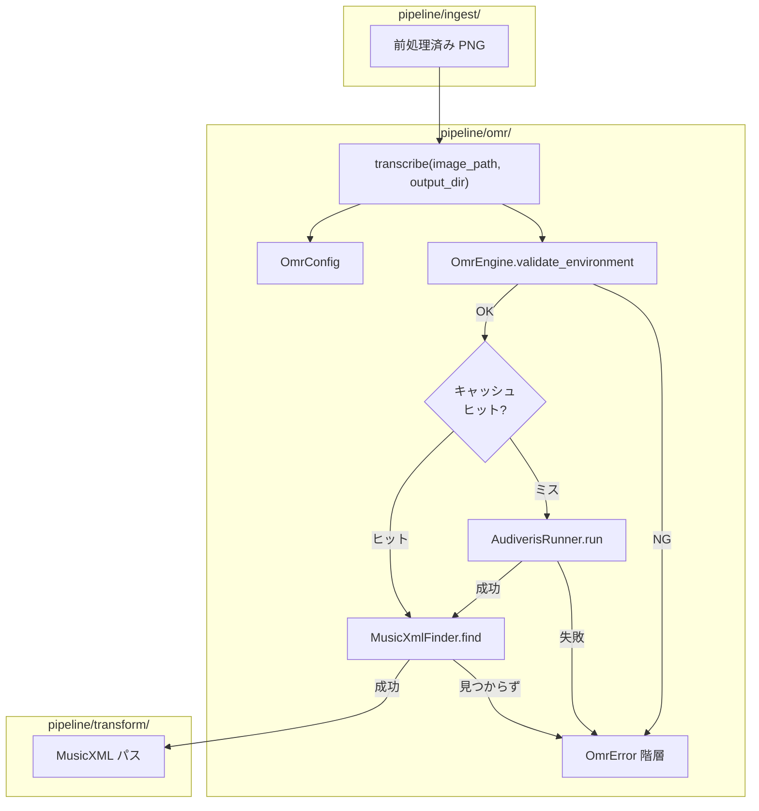
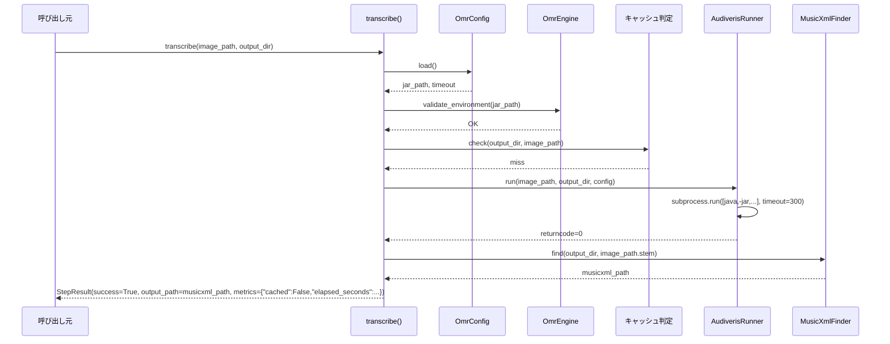
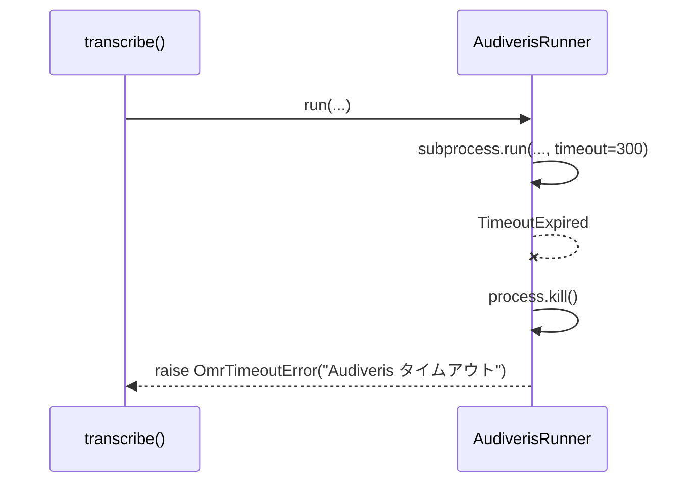

# Design Document — omr-engine-integration

## Overview

前処理済み PNG 画像を入力として Audiveris CLI (`java -jar`) を実行し、MusicXML ファイルを生成する `pipeline/omr/` ドメインを実装する。
Audiveris の内部構造には一切触れず、CLI 経由のみで連携するという設計鉄則を遵守する。

**Purpose**: このフィーチャーは Audiveris OMR エンジンをパイプラインの第2ステップとして組み込み、楽譜画像を後続の Transform・Render ドメインが消費可能な MusicXML 形式に変換する機能を提供する。

**Users**: `pipeline/omr/transcribe()` は `pipeline/ingest/` の出力（前処理済み PNG）を受け取り、`pipeline/transform/` に MusicXML パスを渡す中間ドメインとして機能する。

**Impact**: Ingest ドメインの完了後に OMR ドメインが起動し、各 PNG に対して Audiveris プロセスを制御・監視・キャッシュする。

### Goals

- `transcribe(image_path, output_dir) -> StepResult` の単一エントリポイント関数を公開する
- Java 17+ および Audiveris JAR の存在を事前検証する
- Audiveris CLI を subprocess でタイムアウト管理付きで実行する
- キャッシュヒット時は Audiveris を再実行せず即座に `StepResult` を返す
- `OmrError` 継承階層で OMR 固有エラーを型安全に伝播する

### Non-Goals

- Audiveris の内部パラメータチューニング（`docs/omr-pipeline.md` で管理）
- MusicXML の内容バリデーション（Transform ドメインの責務）
- 複数 PNG の並列 Audiveris 実行（バッチ管理は呼び出し元の責務）
- GUI / ヘッドレス X server の管理

---

## Requirements Traceability

| Requirement | Summary | Components | Interfaces |
|-------------|---------|------------|------------|
| 1.1–1.5 | 実行環境検証（Java 17+・JAR 存在確認） | `OmrEngine.validate_environment()` | `OmrEnvironmentError` |
| 2.1–2.6 | Audiveris CLI 実行・タイムアウト・ログ | `AudiverisRunner.run()` | `OmrTimeoutError`・`OmrExecutionError` |
| 3.1–3.6 | MusicXML 取得・well-formed 検証 | `MusicXmlFinder.find()` | `OmrOutputError` |
| 4.1–4.5 | ステップキャッシュ（`output_dir` 内既存ファイル判定） | `transcribe()` / `AudiverisRunner` | `StepResult.metrics["cached"]` |
| 5.1–5.4 | `OmrError` 継承階層・mypy strict | `pipeline/omr/errors.py` | `OmrError(PipelineError)` |
| 6.1–6.4 | 設定ロード（env var → properties → default） | `OmrConfig` | `AUDIVERIS_JAR`・`AUDIVERIS_TIMEOUT` |

---

## Architecture

### Existing Architecture Analysis

`pipeline/ingest/` が確立した以下のパターンを OMR ドメインでも踏襲する:

- **単一エントリ関数**: `load(input_path, cache_dir) -> StepResult` パターン → `transcribe(image_path, output_dir) -> StepResult`
- **エラー伝播**: `IngestError(PipelineError)` → `OmrError(PipelineError)`
- **キャッシュ判定**: `cache_dir` 内の既存ファイル存在確認 → `output_dir` 内の MusicXML 存在確認
- **ロガー**: `get_logger(__name__)` を各モジュール先頭で取得

### Architecture Pattern & Boundary Map



**Architecture Integration**:
- Selected pattern: **Adapter（CLI ラッパー）** — Audiveris CLI を `AudiverisRunner` クラスで抽象化し、テスト時にモック化可能にする
- Domain boundary: `pipeline/omr/` は `pipeline/ingest/` の出力パスを引数で受け取り、MusicXML パスを `StepResult.output_path` で返す。直接 import なし
- Steering compliance: `Audiveris CLI のみ使用`・`ドメイン間はファイルパス文字列で疎結合`・`subprocess タイムアウト必須` の各鉄則を遵守

### Technology Stack & Alignment

| Layer | Choice / Version | Role in Feature | Notes |
|-------|-----------------|-----------------|-------|
| Runtime | Python 3.11+ | ドメイン実装言語 | 既存スタック |
| OMR Engine | Audiveris 5.3+ (Java 17+) | CLI 経由で楽譜認識 | `java -jar` 呼び出しのみ |
| プロセス管理 | `subprocess` (stdlib) | Audiveris CLI 制御 | `shell=False` 必須（インジェクション防止） |
| XML 検証 | `lxml` 4.x | MusicXML well-formed 確認 | 既存スタック |
| ZIP 展開 | `zipfile` (stdlib) | `.mxl` 圧縮形式の展開 | `.mxl` は ZIP 内に XML |
| 設定 | `configparser` (stdlib) | `audiveris.properties` 読み込み | 標準ライブラリ優先 |
| 構造化ログ | `structlog` | 処理ログ出力 | 既存スタック |

---

## System Flows

### 正常フロー（キャッシュミス → Audiveris 実行）



### エラーフロー（タイムアウト）



---

## Components and Interfaces

### Summary

| Component | Domain/Layer | Intent | Req Coverage | Key Dependencies | Contracts |
|-----------|--------------|--------|--------------|-----------------|-----------|
| `transcribe()` | omr (public API) | 単一エントリポイント | 1.1–6.4 (全) | OmrEngine, AudiverisRunner, MusicXmlFinder, OmrConfig | `StepResult` |
| `OmrConfig` | omr/config | 設定ロード（env → props → default） | 6.1–6.4 | `configparser`, `os.environ` | `OmrConfigData` |
| `OmrEngine` | omr/engine | 環境検証（Java・JAR） | 1.1–1.5 | `subprocess`, `Path` | `OmrEnvironmentError` |
| `AudiverisRunner` | omr/runner | CLI 実行・タイムアウト管理 | 2.1–2.6 | `subprocess`, `OmrConfig` | `OmrTimeoutError`, `OmrExecutionError` |
| `MusicXmlFinder` | omr/finder | 出力 MusicXML 探索・検証 | 3.1–3.6 | `lxml`, `zipfile`, `Path` | `OmrOutputError` |
| `OmrError` 階層 | omr/errors | 型安全なエラー伝播 | 5.1–5.4 | `pipeline.common.PipelineError` | サブクラス4種 |

---

### pipeline/omr — Public API

#### `transcribe()`

| Field | Detail |
|-------|--------|
| Intent | 前処理済み PNG を受け取り Audiveris CLI を実行して MusicXML パスを返す |
| Requirements | 1.1–6.4（全要件） |

**Responsibilities & Constraints**
- `OmrConfig.load()` → `OmrEngine.validate_environment()` → キャッシュ判定 → `AudiverisRunner.run()` → `MusicXmlFinder.find()` の順で実行する
- キャッシュヒット時は `AudiverisRunner.run()` を呼ばない
- `output_dir` の作成は呼び出し元の責務（本関数は `mkdir` しない）
- `print()` 不使用、`get_logger(__name__)` で structlog を使用

**Interface**

```python
def transcribe(
    image_path: Path,
    output_dir: Path,
    *,
    runner: AudiverisRunner | None = None,
) -> StepResult: ...
```

**Dependencies**
- Inbound: `pipeline/ingest/` — 前処理済み PNG パス (P0)
- Outbound: `pipeline/transform/` — MusicXML パス (P0)

---

### pipeline/omr — OmrConfig

#### `OmrConfig`

| Field | Detail |
|-------|--------|
| Intent | Audiveris JAR パス・タイムアウト・追加オプションを env var → properties → default の優先度で解決する |
| Requirements | 6.1, 6.2, 6.3, 6.4 |

**Responsibilities & Constraints**
- `AUDIVERIS_JAR` 環境変数 → `config/audiveris.properties` の `audiveris.jar` → `OmrConfigError` の優先順で JAR パスを解決する
- `AUDIVERIS_TIMEOUT` 環境変数 → `config/audiveris.properties` の `audiveris.timeout` → デフォルト 300 秒
- `config/audiveris.properties` が存在しない場合は警告ログのみ出力し、デフォルト値で続行する

**Interface**

```python
@dataclass(frozen=True)
class OmrConfigData:
    jar_path: Path
    timeout_seconds: int
    extra_options: dict[str, str]

class OmrConfig:
    @staticmethod
    def load(
        properties_path: Path = Path("config/audiveris.properties"),
    ) -> OmrConfigData: ...
```

---

### pipeline/omr — OmrEngine

#### `OmrEngine`

| Field | Detail |
|-------|--------|
| Intent | Java バージョンと Audiveris JAR の存在を事前検証する |
| Requirements | 1.1, 1.2, 1.3, 1.4, 1.5 |

**Responsibilities & Constraints**
- `java -version` を subprocess で実行し、バージョン文字列から major version を抽出して 17 以上であることを確認する
- JAR ファイルの `Path.exists()` を確認する
- 失敗時は `OmrEnvironmentError` を raise する

**Interface**

```python
class OmrEngine:
    @staticmethod
    def validate_environment(jar_path: Path) -> None: ...
```

---

### pipeline/omr — AudiverisRunner

#### `AudiverisRunner`

| Field | Detail |
|-------|--------|
| Intent | Audiveris CLI を subprocess で実行し、タイムアウト・終了コード・ログを管理する |
| Requirements | 2.1, 2.2, 2.3, 2.4, 2.5, 2.6 |

**Responsibilities & Constraints**
- コマンドを **リスト形式**で構築し `shell=False` で実行する（コマンドインジェクション防止）
- `subprocess.run()` に必ず `timeout` を設定する
- `TimeoutExpired` を `process.kill()` 後に `OmrTimeoutError` へ変換する
- 終了コード非0を `OmrExecutionError`（stderr 含む）へ変換する
- stdout/stderr は `structlog` の DEBUG ログに記録する
- 経過時間を計測し `metrics["elapsed_seconds"]` に記録する

**Interface**

```python
class AudiverisRunner:
    DEFAULT_OPTIONS: ClassVar[dict[str, str]] = {
        "org.audiveris.omr.sheet.grid.LineClusterAdapter.useTablature": "true",
        "org.audiveris.omr.sig.inter.AbstractInter.minGrade": "0.35",
    }

    def run(
        self,
        image_path: Path,
        output_dir: Path,
        config: OmrConfigData,
    ) -> dict[str, float | int | str | bool]: ...
    # 戻り値: metrics dict（elapsed_seconds 等）。出力の探索は MusicXmlFinder の責務
```

**Dependencies**
- Inbound: `transcribe()` — 実行委譲 (P0)
- Outbound: OS / Java プロセス — Audiveris CLI (P0)

---

### pipeline/omr — MusicXmlFinder

#### `MusicXmlFinder`

| Field | Detail |
|-------|--------|
| Intent | output_dir 内の MusicXML ファイルを探索し、well-formed であることを確認してパスを返す |
| Requirements | 3.1, 3.2, 3.3, 3.4, 3.5, 3.6 |

**Responsibilities & Constraints**
- `output_dir.glob("*.mxl")` → `output_dir.glob("*.xml")` の優先順でファイルを探索する
- `.mxl` は `zipfile` で展開後に `lxml.etree.parse()` で well-formed 確認する
- `.xml` は直接 `lxml.etree.parse()` で確認する
- MusicXML が見つからない場合は `OmrOutputError` を raise する
- well-formed でない場合は `OmrOutputError` を raise しファイルパスをメッセージに含める

**Interface**

```python
class MusicXmlFinder:
    @staticmethod
    def find(output_dir: Path, stem: str) -> Path: ...
    # 戻り値: 発見・検証済みの MusicXML ファイルパス（.mxl または .xml）
```

---

### pipeline/omr — Error Hierarchy

#### `OmrError` 継承階層

| Field | Detail |
|-------|--------|
| Intent | OMR ドメイン固有の例外を型安全に表現し、PipelineError と区別しつつ呼び出し元で選択的 catch 可能にする |
| Requirements | 5.1, 5.2, 5.3, 5.4 |

**Interface**

```python
# pipeline/omr/errors.py

class OmrError(PipelineError): ...

class OmrEnvironmentError(OmrError): ...   # Java 未検出・JAR 不在
class OmrTimeoutError(OmrError): ...       # subprocess タイムアウト
class OmrExecutionError(OmrError): ...     # Audiveris 終了コード非0
class OmrOutputError(OmrError): ...        # MusicXML 不在・破損
```

**Constraints**
- raw な `Exception`・`subprocess.CalledProcessError`・`subprocess.TimeoutExpired` を外部に漏らさない
- `StepResult(success=False)` で失敗を表現せず、必ず例外で伝播する

---

## Data Models

### `StepResult` (既存・変更なし)

`pipeline/common.py` の `StepResult` をそのまま使用する。OMR ドメイン固有の `metrics` キー：

| Key | Type | Description |
|-----|------|-------------|
| `cached` | `bool` | キャッシュヒットした場合 `True` |
| `elapsed_seconds` | `float` | Audiveris CLI の経過秒数（キャッシュヒット時は 0.0） |
| `musicxml_path` | `str` | 生成された MusicXML の絶対パス文字列 |

### `OmrConfigData` (新規)

```python
@dataclass(frozen=True)
class OmrConfigData:
    jar_path: Path
    timeout_seconds: int           # デフォルト: 300
    extra_options: dict[str, str]  # audiveris.properties からの追加オプション
```

---

## File Structure

```
pipeline/
└── omr/
    ├── __init__.py           # transcribe() を re-export
    ├── _transcribe.py        # transcribe() 公開エントリポイント
    ├── config.py             # OmrConfig, OmrConfigData
    ├── engine.py             # OmrEngine（環境検証）
    ├── runner.py             # AudiverisRunner（CLI 実行）
    ├── finder.py             # MusicXmlFinder（出力探索・検証）
    └── errors.py             # OmrError 継承階層

tests/
└── unit/
    └── test_omr/
        ├── test_config.py
        ├── test_engine.py
        ├── test_runner.py
        ├── test_finder.py
        └── test_transcribe.py
```
