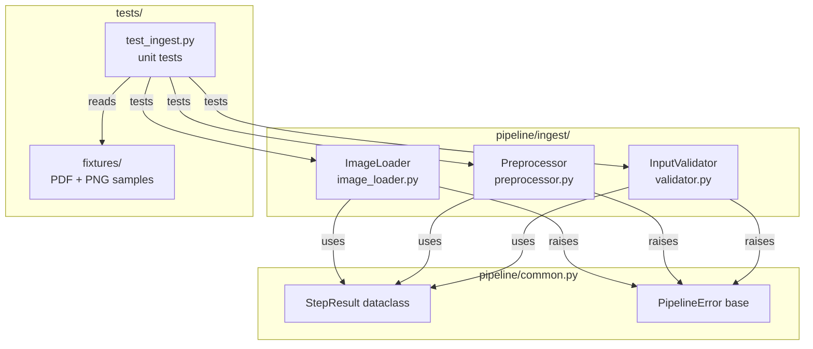
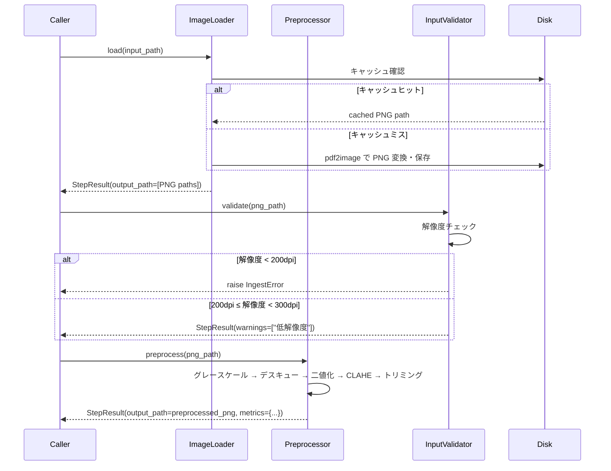

# Design Document — phase1-foundation

## Overview

`phase1-foundation` は band-score-to-midi パイプラインの最初の実装フェーズであり、
全ドメインで共有される共通型定義と、PDF/PNG バンドスコア画像を Audiveris が処理可能な
高品質 PNG (300dpi+) に変換する Ingest ドメイン 3 モジュールを TDD で実装する。

このフェーズが完了することで、Phase 2 (OMR) 以降のすべてのドメインが `StepResult` /
`PipelineError` を使ったインターフェース規約に準拠できる基盤が整う。

**Users**: パイプライン開発者（ドメイン実装者）および CLI ユーザー（バンドスコア変換者）。  
**Impact**: `pipeline/` ディレクトリを新規作成し、Ingest ドメインを動作状態にする。

### Goals

- `pipeline/common.py` に `StepResult` / `PipelineError` を定義し全ドメインの型規約を確立する
- PDF/PNG/TIFF/JPEG → 前処理済み PNG (300dpi+) の変換パイプラインを動作させる
- ユニットテストカバレッジ 80%+ を達成し、TDD サイクルを確立する

### Non-Goals

- OMR (Audiveris) 呼び出しは対象外（Phase 2）
- MusicXML 変換・MIDI 出力は対象外（Phase 3〜4）
- CLI エントリポイント (`pipeline/__main__.py`) は対象外

---

## Requirements Traceability

| 要件 ID | 要件概要 | 実装コンポーネント |
|--------|----------|-----------------|
| 1.1–1.5 | 共通型定義・型ヒント・structlog | `pipeline/common.py` |
| 2.1–2.6 | PDF/画像読み込み・キャッシュ | `pipeline/ingest/image_loader.py` |
| 3.1–3.7 | 画像前処理（デスキュー・二値化・CLAHE） | `pipeline/ingest/preprocessor.py` |
| 4.1–4.5 | 解像度・黒画素比率バリデーション | `pipeline/ingest/validator.py` |
| 5.1–5.5 | ユニットテスト・フィクスチャ・カバレッジ | `tests/unit/test_ingest.py` / `tests/fixtures/` |

---

## Architecture

### Architecture Pattern & Boundary Map



**アーキテクチャ統合**:
- パターン: ファイルパス疎結合パイプライン（steering `structure.md` 準拠）
- ドメイン間通信: `StepResult.output_path` のみ（直接 import 禁止）
- 依存方向: `common.py ← ingest/*` の一方向のみ

### Technology Stack

| Layer | 選択 / バージョン | 役割 | 備考 |
|-------|-----------------|------|------|
| 言語 | Python 3.11+ | 実装全体 | |
| PDF 変換 | pdf2image 1.x | PDF → PNG (300dpi) | poppler システム依存 |
| 画像処理 | opencv-python 4.x | デスキュー・二値化・CLAHE | |
| 画像 I/O | pillow 10.x | PNG 保存・メタデータ読み取り | |
| ログ | structlog 24.x | 構造化 JSON ログ | `print()` 禁止 |
| テスト | pytest 8.x + pytest-cov | TDD・カバレッジ計測 | |
| 型チェック | mypy 1.x (strict) | 型安全性保証 | |

---

## System Flows

### PDF → 前処理済み PNG 変換フロー



---

## Components & Interface Contracts

### 1. `pipeline/common.py`

要件: 1.1–1.5

```python
@dataclass
class StepResult:
    success: bool
    output_path: Path | list[Path]  # 単一ファイルまたはページリスト
    metrics: dict[str, float | int | str]
    warnings: list[str]

class PipelineError(Exception):
    """全パイプラインエラーの基底クラス"""

class IngestError(PipelineError):
    """Ingest ドメイン固有のエラー"""
```

**制約**:
- すべての公開シンボルに型ヒントを付ける
- `common.py` 以外のモジュールを import しない

---

### 2. `pipeline/ingest/image_loader.py`

要件: 2.1–2.6

| メソッド | シグネチャ | 説明 |
|---------|-----------|------|
| `load` | `(input_path: Path, cache_dir: Path = Path(".cache/ingest")) -> StepResult` | PDF/画像を PNG に変換してキャッシュ |

**動作仕様**:
- PDF: `pdf2image.convert_from_path(dpi=300)` → 各ページを `cache_dir/{stem}_p{n:03d}.png` に保存
- PNG/TIFF/JPEG: そのまま `cache_dir/` にコピー（同名ファイル存在時はスキップ）
- 非対応拡張子 → `IngestError("Unsupported format: {ext}. Supported: pdf, png, tiff, jpeg")`
- ファイル不在 → `IngestError("File not found: {path}")`
- `StepResult.output_path` = `list[Path]` (ページリスト、1ページ PDF も list で返す)
- `StepResult.metrics` = `{"page_count": int, "cached": bool}`

---

### 3. `pipeline/ingest/preprocessor.py`

要件: 3.1–3.7

| メソッド | シグネチャ | 説明 |
|---------|-----------|------|
| `preprocess` | `(image_path: Path, output_dir: Path = Path(".cache/preprocess")) -> StepResult` | 前処理パイプラインを実行 |

**前処理ステップ（順番固定）**:

| # | 処理 | ライブラリ | パラメータ |
|---|------|-----------|-----------|
| 1 | グレースケール変換 | `cv2.cvtColor(GRAY)` | — |
| 2 | デスキュー | `HoughLinesP` + `getRotationMatrix2D` | 検出角度 > ±10° は補正しない（警告のみ） |
| 3 | Otsu 二値化 | `cv2.threshold(OTSU)` | — |
| 4 | CLAHE | `cv2.createCLAHE(clipLimit=2.0, tileGridSize=(8,8))` | — |
| 5 | 余白トリミング | `cv2.boundingRect` + スライス | 楽譜領域の外接矩形 |

**後処理チェック**:
- 黒画素比率 5〜40% 範囲外 → `StepResult.warnings` に追記（エラーではなく警告）

**戻り値**:
- `StepResult.output_path` = `Path` (前処理済み PNG 1ファイル)
- `StepResult.metrics` = `{"skew_angle": float, "binarization_threshold": int, "black_pixel_ratio": float}`

---

### 4. `pipeline/ingest/validator.py`

要件: 4.1–4.5

| メソッド | シグネチャ | 説明 |
|---------|-----------|------|
| `validate` | `(image_path: Path) -> StepResult` | 解像度・黒画素比率を検証 |

**検証ルール**:

| 条件 | 動作 |
|------|------|
| 解像度 < 200dpi | `IngestError("Resolution {dpi}dpi below minimum 200dpi")` |
| 200dpi ≤ 解像度 < 300dpi | `StepResult.warnings` に `"Low resolution: {dpi}dpi (recommended: 300dpi+)"` |
| 解像度 ≥ 300dpi | 警告なし |
| 黒画素比率 < 5% または > 40% | `StepResult.warnings` に `"Unusual black pixel ratio: {ratio:.1%}"` |

**DPI 取得方法**: `PIL.Image.open(path).info.get("dpi", (72, 72))` → 短辺方向を使用

**戻り値**:
- `StepResult.output_path` = 入力 `image_path` をそのまま返す（変換なし）
- `StepResult.metrics` = `{"dpi": float, "black_pixel_ratio": float}`

---

## Data Models

```python
# pipeline/common.py — 唯一の共有データ型

@dataclass
class StepResult:
    success: bool
    output_path: Path | list[Path]
    metrics: dict[str, float | int | str]
    warnings: list[str]

    @classmethod
    def ok(
        cls,
        output_path: Path | list[Path],
        metrics: dict[str, float | int | str] | None = None,
        warnings: list[str] | None = None,
    ) -> "StepResult":
        return cls(
            success=True,
            output_path=output_path,
            metrics=metrics or {},
            warnings=warnings or [],
        )
```

---

## Non-Functional Requirements

| 項目 | 要件 | 実装方針 |
|------|------|---------|
| テストカバレッジ | `pipeline/ingest/` で 80%+ | `pytest-cov` で計測 |
| 型安全性 | `mypy --strict` 通過 | dataclass + 型ヒント全記載 |
| ログ | `structlog` JSON ログのみ | `print()` 禁止 |
| Java 非依存 | Unit テストは `pdf2image` をモック化 | `unittest.mock.patch` |
| キャッシュ | 出力ファイル存在時はスキップ | `Path.exists()` チェック |

---

## Directory Layout（生成物）

```
pipeline/
├── __init__.py
├── common.py                   ← StepResult, PipelineError, IngestError
└── ingest/
    ├── __init__.py
    ├── image_loader.py
    ├── preprocessor.py
    └── validator.py

tests/
├── fixtures/
│   ├── sample_score.pdf        ← テスト用楽譜 (最低1ページ)
│   └── sample_score.png        ← テスト用楽譜 PNG
└── unit/
    └── test_ingest.py
```
