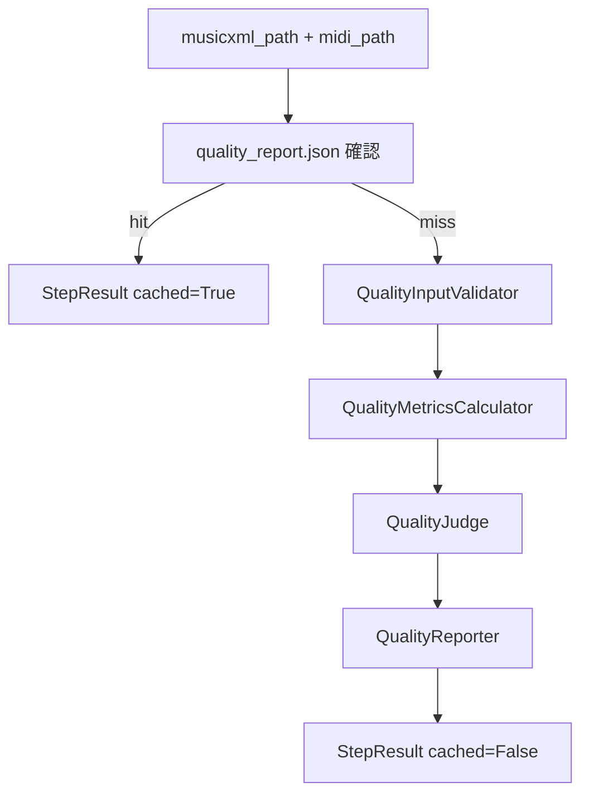
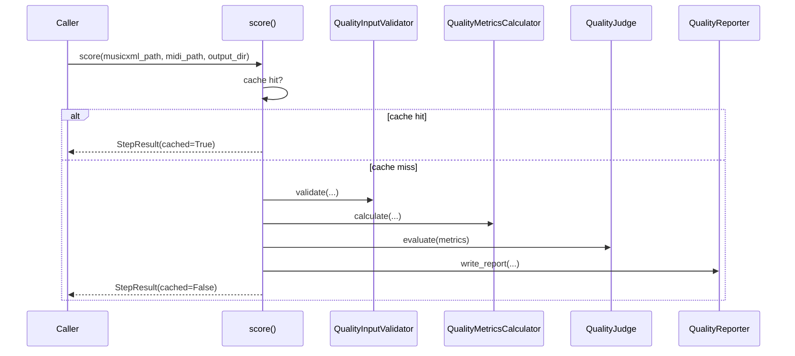

# Design Document — quality-scoring

## Overview

`quality-scoring` は、Transform 済み MusicXML と Render 済み MIDI を読み取り、
品質メトリクス・総合品質スコア・判定結果を `quality_report.json` に永続化する Quality ドメインである。

`music21` を主に MusicXML 解析に使い、MIDI は `mido` で読み取り可能性を確認する。
品質評価の中心は [docs/QUALITY_SCORE.md](docs/QUALITY_SCORE.md) に定義された 4 指標である。

---

### Goals

- 4 つの品質メトリクスを算出する
- 総合品質スコアと PASS / REVIEW / FAIL を決定する
- 警告と統計を `quality_report.json` に出力する
- キャッシュ・公開 API・例外階層を他ドメインと同じパターンで提供する

### Non-Goals

- OMR / Transform / Render の結果を修正すること
- Audiveris SIG 生データの完全解析
- GUI 向けの可視化

---

## Requirements Traceability

| 要件 | 概要 | コンポーネント | インターフェース |
|---|---|---|---|
| 1.1-1.5 | 個別メトリクス算出 | `metrics.py` | `QualityMetricsCalculator.calculate()` |
| 2.1-2.5 | 総合スコアと判定 | `judge.py` | `QualityJudge.evaluate()` |
| 3.1-3.4 | JSON レポート生成 | `reporter.py` | `QualityReporter.write_report()` |
| 4.1-4.5 | キャッシュ / 公開 API / 例外 | `_score.py`, `errors.py` | `score()` |
| 5.1-5.4 | 入力検証 | `validator.py` | `QualityInputValidator.validate()` |

---

## Architecture



### Components

#### `errors.py`

- `QualityError(PipelineError)`
- `QualityValidationError(QualityError)`
- `QualityExecutionError(QualityError)`

#### `validator.py`

責務:
- MusicXML と MIDI の存在確認
- MusicXML パース可能性確認
- MIDI 読み込み可能性確認

#### `metrics.py`

責務:
- `omr_confidence`
- `measure_completeness`
- `pitch_range_validity`
- `part_detection_rate`
- 警告と統計の素材を返す

#### `judge.py`

責務:
- 重み付き総合スコア計算
- PASS / REVIEW / FAIL の決定

#### `reporter.py`

責務:
- JSON レポートの構築と書き出し

#### `_score.py`

責務:
- キャッシュ確認
- validator / metrics / judge / reporter の統合
- `StepResult` の返却

---

## Data Model

```python
@dataclass(frozen=True)
class QualityMetrics:
    omr_confidence: float
    measure_completeness: float
    pitch_range_validity: float
    part_detection_rate: float
    warnings: list[dict[str, str]]
    total_measures: int
    total_notes: int
```

```python
@dataclass(frozen=True)
class QualityDecision:
    overall_score: float
    judgment: Literal["PASS", "REVIEW", "FAIL"]
```

---

## System Flow

